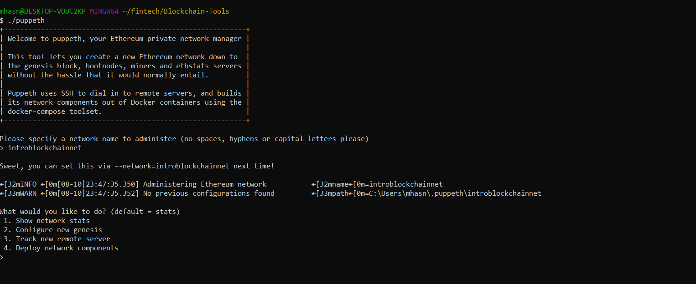

# Week 18 Assignment: Proof of Authority Development Blockchain

Assignment: Set up a private testnet that can be used to explore potentials for blockchain at ZBank.

On Github, all screenshots used in this README file are saved in a screenshots folder.
Also, folders for Node01 and Node02 including relevant files have also been uploaded.

# 1.0 Background

For the purpose of this assignment, a private Proof of Authority (PoA) blockchain has been set up along with two nodes. For testing purposes keys have also been provided to access the node accounts.

# 2.0 Requirements

For the purpose of this assignment, we will need a MyCrypto Wallet and Go Ethereum (Geth) tools. Installation details can be found in the installation guides.

# 3.0 Details

Details for 

Pre-configured Node 01:

Public address of the key: 0x029d14259e87FA8A14229a86a55F2076571a6dBC
Private address of the key: 0x88ce6ff321d69e72427ccf1e1ef949b16d584a6fd5b9ec032f89c195c53ff170

Pre-configured Node 02:

Public address of the key:  0xcdaF41Bbe50a47B6B4322B61b09c85980D6EA00b
Private address of the key: 0x1a4630a6d3ea9973c6b3145c9a4d626869a09c15c23c45c839c4260503b6efb2

Testnet: introblockchainnet

# 4.0 Genesis process

The Proof of Authority (PoA) algorithm is typically used for private blockchain networks as it requires pre-approval of, or voting
in of, the account addresses that can approve transactions (seal blocks). For this we will create two new nodes with new account addresses that will serve this purpose.

# 4.1 To create two new nodes:

Using gitbash, access the Blockchain-Tools folder. Create two new node accounts (node 01 and 02) by entering the below commands one at a time:

./geth --datadir node01 account new

./geth --datadir node02 account new

For each node:

Enter in a password of your selection. Following the password prompt, you will get provided with the public address details and path of the secret key file. Note that down.

# 4.2 To create blockchain genesis block:

In Gitbash access the Blockchain-Tools folder. Initiate puppeth with the following command:

./puppeth

When prompted, enter in the network name :

introblockchainnet

Then take the following steps:

When prompted, select 2. Configure new genesis, by entering:

2

When prompted, select 1. Create new genesis from scratch, by entering:

1

When prompted, select 2. Clique - Proof-of-Authority, by entering:

2

When prompted, hit enter to select the default of 15 seconds per block.

When prompted for accounts allowed to seal, paste in the public key of both node accounts created earlier.

When prompted for pre-funded accounts allowed to seal, paste in the public key of both node accounts created earlier.

Select yes to pre-fund the accounts with 1 Wei

Enter 888 as the Chain ID.

# 4.3 Initialise the new nodes with the testnet

To initialise the nodes 01 & 02 using the testnet 'introblockchainnet':

Open a new Gitbash terminal, access the Blockchain-Tools folder. Then enter the following commands:

./geth --datadir node01 init introblockchainnet.json

For node 02:

./geth --datadir node02 init introblockchainnet.json

# 4.4 Run the nodes with the testnet

To run the nodes, in separate terminal enter the following commands:

For  node01:
(replace SEALER_ONE_ADDRESS with the public key for that node)

./geth --datadir node01 --unlock "SEALER_ONE_ADDRESS" --mine --rpc --allow-insecure-unlock

For  node02*:

./geth --datadir node02 --unlock "SEALER_TWO_ADDRESS" --mine --port 30304 --bootnodes "enode://SEALER_ONE_ENODE_ADDRESS@127.0.0.1:30303" --ipcdisable --allow-insecure-unlock

(replace SEALER_TWO_ADDRESS with the public key for that node and replace "enode://SEALER_ONE_ENODE_ADDRESS@127.0.0.1:30303" with the enode below )

Copied from node01 initiation: enode://dfabd3ef10366735f1c51336628e8f1f756e0ea157c355fe4e238b0bfc4e659a3b090674f7ab372af96270d56cdeda7a597628556e1c424d32a7baaeb643df37@127.0.0.1:30303

(You will be required to enter your password to initialize both nodes)

Following this process should have started the mining process, however in this instance it failed to connect with the peers.

*Node 02 is a bootstrap node which allows you to pass the network info needed to find other nodes in the blockchain (i.e. tells your node
at what address to find your bootnode). This will allow us to connect both of our nodes.
w

# 5.0 Send a test transaction

To send a test transaction and transfer funds between each nodes we will need to use the MyCrypto GUI wallet to connect to the node with the exposed RPC port.

To use MyCrypto GUI wallet, set up a custom testnet:

Node Name: introblockchainnet
Network: Custom
Network Name: introblockchainnet
Currency: ETH
Chain ID: 888
URL: 127.0.0.1:8545

Under normal circumstances, you should be able to transfer ETH from one node to another once you are connected to the test network. In this case, MyCrypto wallet failed to connect to the test network.

In MyCrypto Wallet, click on 'view and send', then click on 'Keystore file' and select the file in the node01 folder. Unlock it using your password. From there on, you should be able to transfer Eth from one node to another. 

